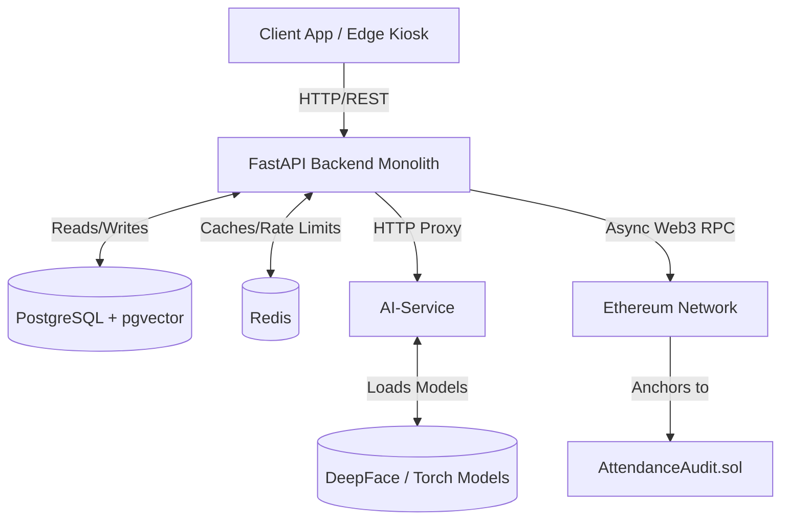
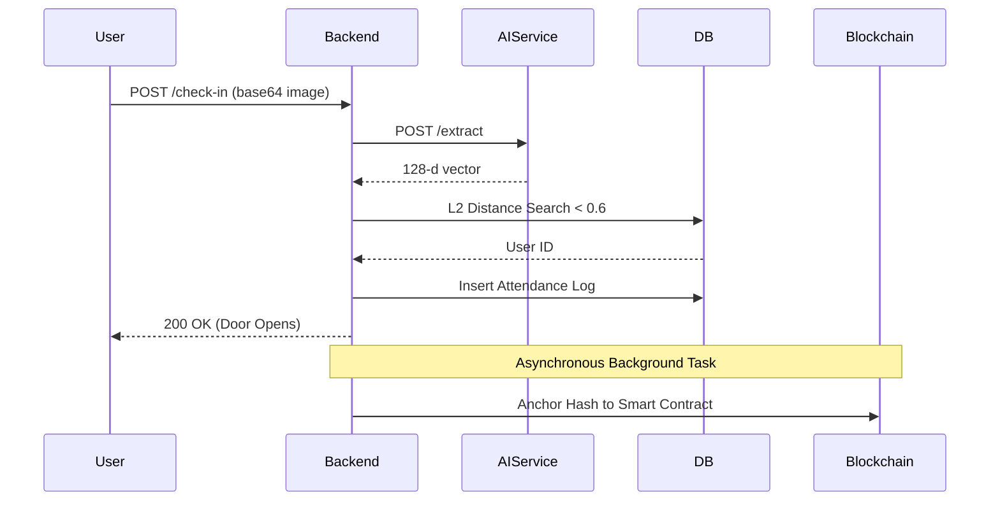

# Architecture Blueprint

## High-Level Architecture
The system employs a **Hybrid Proxy Architecture**. The FastAPI `backend` handles 95% of requests natively but proxies heavy biometric processing to the isolated `ai-service`.

## Architectural Decisions & Trade-offs
1. **Proxy vs Message Queue**: We chose HTTP Proxying over Kafka/RabbitMQ for the AI-service communication because attendance check-ins require immediate, synchronous feedback to open physical doors. Event-driven architectures introduce asynchronous complexity that is detrimental to physical access control.
2. **PostgreSQL pgvector vs Milvus**: We consolidated vector storage into PostgreSQL using the `pgvector` extension rather than introducing a dedicated vector DB (like Pinecone or Milvus). This drastically simplifies deployment and ensures relational data (User IDs) and vector data are backed up simultaneously, preventing split-brain corruption.

## Component Flow

