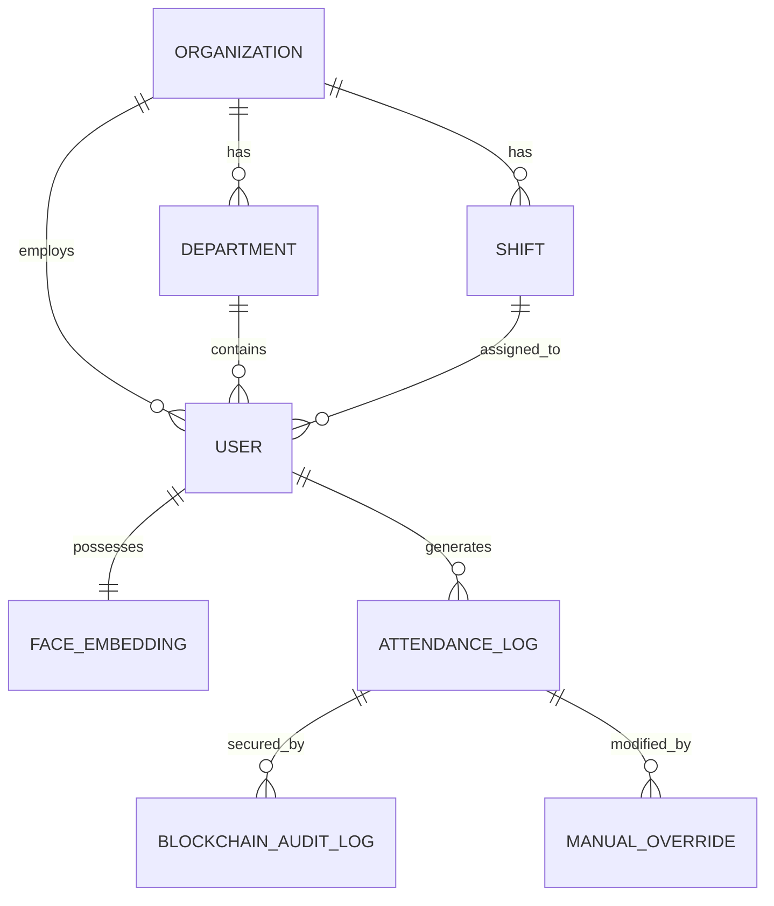

# Database Design

The system uses a highly normalized PostgreSQL schema mapped via SQLAlchemy ORM.

## Entity Relationship Summary

## Critical Tables

### `users`
* `id`: Integer (PK)
* `org_id`: UUID (FK)
* `role_id`: Integer (FK)
* `username`: String (Unique)
* `hashed_password`: String (bcrypt)

### `face_embeddings`
* `user_id`: Integer (PK, FK)
* `embedding`: `VECTOR(128)` -> Uses `pgvector` for L2 distance matching.
* `is_active`: Integer (0/1)

### `attendance_logs`
* `id`: Integer (PK)
* `user_id`: Integer (FK)
* `check_in`: DateTime (UTC)
* `check_out`: DateTime (UTC)
* `shift_status`: String ("On Time", "Late", "Early")
* `is_overridden`: Integer (0/1)

### `system_settings`
* `id`: Integer (PK)
* `setting_key`: String (e.g., `blockchain_enabled`)
* `setting_value`: String (e.g., `true`)

## Migration Strategy
Database migrations are strictly handled via **Alembic**. Developers MUST run `alembic revision --autogenerate` when altering models. Manual execution of DDL (`CREATE TABLE`, `ALTER TABLE`) directly in PostgreSQL is prohibited to maintain schema integrity.
