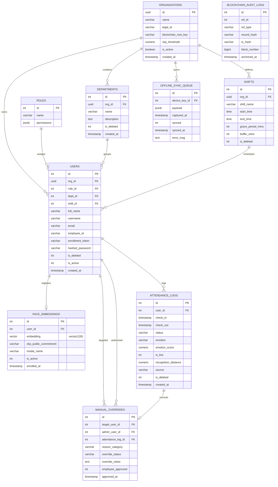

# Database Schema & API Contracts
## Schema, ER Diagram, and OpenAPI Specification

### 1. Database Schema and ER Diagram
The system uses isolated databases for distinct domains. Below is the Entity Relationship Diagram showing the schema configurations and indices.



---

### 2. pgvector HNSW Index Optimization
To support sub-500ms face matching latency across massive databases, we use the **HNSW (Hierarchical Navigable Small World)** indexing method in PostgreSQL. The distance metric is set to **Cosine Similarity** (`vector_cosine_ops`), which corresponds to the normalized embedding comparisons.

#### SQL Index Creation Script:
```sql
-- Ensure vector extension is loaded
CREATE EXTENSION IF NOT EXISTS vector;

-- Create an HNSW index with Cosine similarity optimization
-- m = Max number of connections per layer
-- ef_construction = Size of the dynamic candidate list for index building
CREATE INDEX IF NOT EXISTS idx_face_embeddings_vector_hnsw 
ON face_embeddings 
USING hnsw (embedding vector_cosine_ops)
WITH (m = 16, ef_construction = 64);
```

---

### 3. OpenAPI 3.0 Specification
This is the OpenAPI yaml description for core platform services.

```yaml
openapi: 3.0.3
info:
  title: Face Recognition Attendance Platform API Gateway
  description: Unified API Gateway specification for Multi-Tenant Biometric Attendance management.
  version: 1.0.0
servers:
  - url: http://127.0.0.1:8000/api/v1
paths:
  /auth/login:
    post:
      summary: User authentication (OAuth2 Form compatible)
      tags:
        - Authentication
      requestBody:
        required: true
        content:
          application/x-www-form-urlencoded:
            schema:
              type: object
              properties:
                username:
                  type: string
                  format: email
                password:
                  type: string
              required:
                - username
                - password
      responses:
        '200':
          description: Successful authentication
          content:
            application/json:
              schema:
                type: object
                properties:
                  access_token:
                    type: string
                  refresh_token:
                    type: string
                  token_type:
                    type: string
                    example: bearer
        '401':
          description: Invalid username or password

  /biometrics/enroll:
    post:
      summary: Register employee face embedding
      tags:
        - Biometrics
      security:
        - OAuth2PasswordBearer: []
      requestBody:
        required: true
        content:
          application/json:
            schema:
              type: object
              properties:
                enrollment_token:
                  type: string
                image_base64:
                  type: string
                  description: Base64-encoded JPEG image of employee face
              required:
                - enrollment_token
                - image_base64
      responses:
        '200':
          description: Face registered successfully
        '400':
          description: Enrollment token expired or multiple faces detected

  /attendance/verify:
    post:
      summary: Process camera frame for attendance logging
      tags:
        - Attendance
      requestBody:
        required: true
        content:
          application/json:
            schema:
              type: object
              properties:
                image_base64:
                  type: string
                  description: Frame containing the employee's face
                org_id:
                  type: string
                  format: uuid
              required:
                - image_base64
                - org_id
      responses:
        '200':
          description: Attendance recognized and logged
          content:
            application/json:
              schema:
                type: object
                properties:
                  user_id:
                    type: integer
                  full_name:
                    type: string
                  status:
                    type: string
                    enum: [on_time, late, early]
                  emotion:
                    type: string
                  is_live:
                    type: boolean
        '401':
          description: Liveness check failed or identity unrecognized

  /attendance/sync-batch:
    post:
      summary: Sync offline kiosk transactions in bulk
      tags:
        - Attendance
      security:
        - OrgApiKeyAuth: []
      requestBody:
        required: true
        content:
          application/json:
            schema:
              type: object
              properties:
                logs:
                  type: array
                  items:
                    type: object
                    properties:
                      user_id:
                        type: integer
                      check_in:
                        type: string
                        format: date-time
                      check_out:
                        type: string
                        format: date-time
                      status:
                        type: string
                      captured_at:
                        type: string
                        format: date-time
                    required:
                      - user_id
                      - check_in
                      - status
                      - captured_at
              required:
                - logs
      responses:
        '200':
          description: Batch synchronization complete
        '403':
          description: Invalid Organization Device API key

  /analytics/burnout-heatmap:
    get:
      summary: Get burnout index by department
      tags:
        - Analytics
      security:
        - OAuth2PasswordBearer: []
      responses:
        '200':
          description: Burnout risks computed by Polars
          content:
            application/json:
              schema:
                type: array
                items:
                  type: object
                  properties:
                    dept:
                      type: string
                    total_logs:
                      type: integer
                    stress_count:
                      type: integer
                    stress_index:
                      type: number
                    unique_users:
                      type: integer
components:
  securitySchemes:
    OAuth2PasswordBearer:
      type: oauth2
      flows:
        password:
          tokenUrl: /auth/login
          scopes: {}
    OrgApiKeyAuth:
      type: apiKey
      in: header
      name: X-Device-API-Key
```
