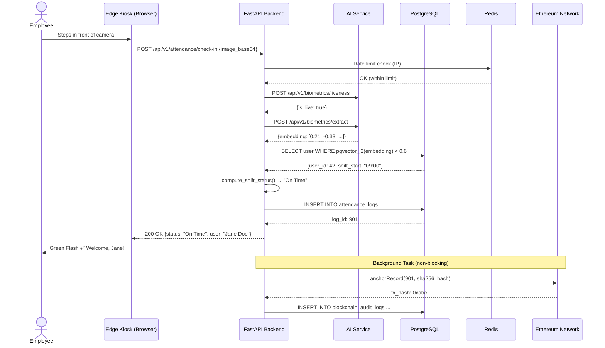
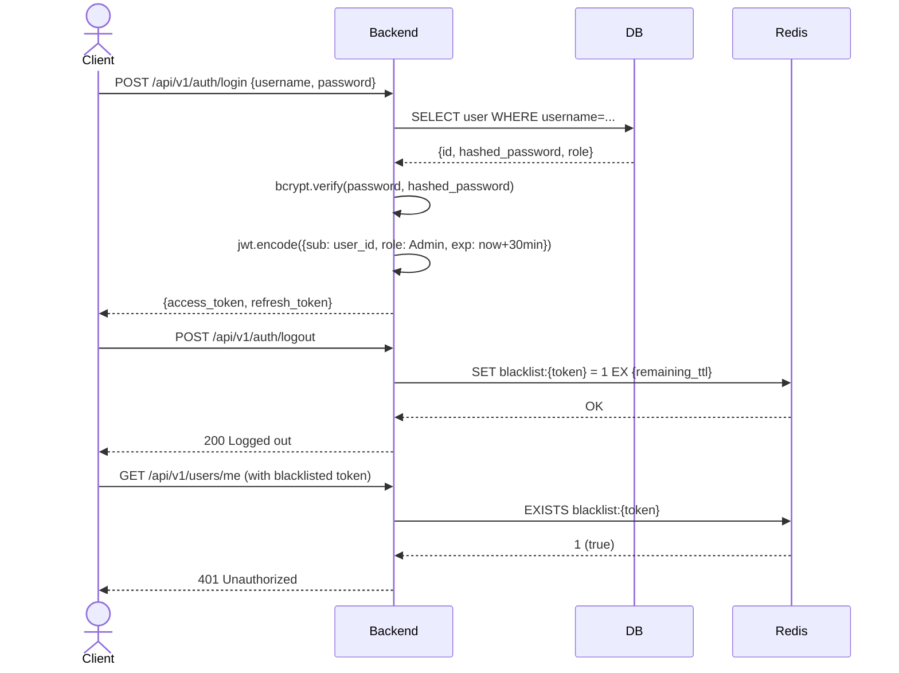
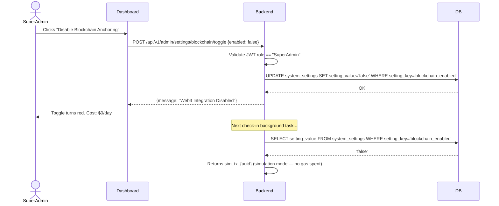

# Sequence Diagrams

## 1. Face Check-In — Happy Path

```mermaid
sequenceDiagram
    actor Employee
    participant Kiosk as Edge Kiosk (Browser)
    participant Backend as FastAPI Backend
    participant AIService as AI Service
    participant DB as PostgreSQL
    participant Redis as Redis
    participant ETH as Ethereum Network

    Employee->>Kiosk: Steps in front of camera
    Kiosk->>Backend: POST /api/v1/attendance/check-in {image_base64}
    Backend->>Redis: Rate limit check (IP)
    Redis-->>Backend: OK (within limit)
    Backend->>AIService: POST /api/v1/biometrics/liveness
    AIService-->>Backend: {is_live: true}
    Backend->>AIService: POST /api/v1/biometrics/extract
    AIService-->>Backend: {embedding: [0.21, -0.33, ...]}
    Backend->>DB: SELECT user WHERE pgvector_l2(embedding) < 0.6
    DB-->>Backend: {user_id: 42, shift_start: "09:00"}
    Backend->>Backend: compute_shift_status() → "On Time"
    Backend->>DB: INSERT INTO attendance_logs ...
    DB-->>Backend: log_id: 901
    Backend-->>Kiosk: 200 OK {status: "On Time", user: "Jane Doe"}
    Kiosk-->>Employee: Green Flash ✅ Welcome, Jane!

    Note over Backend, ETH: Background Task (non-blocking)
    Backend->>ETH: anchorRecord(901, sha256_hash)
    ETH-->>Backend: tx_hash: 0xabc...
    Backend->>DB: INSERT INTO blockchain_audit_logs ...
```

## 2. JWT Authentication Flow

```mermaid
sequenceDiagram
    actor Client
    participant Backend
    participant DB
    participant Redis

    Client->>Backend: POST /api/v1/auth/login {username, password}
    Backend->>DB: SELECT user WHERE username=...
    DB-->>Backend: {id, hashed_password, role}
    Backend->>Backend: bcrypt.verify(password, hashed_password)
    Backend->>Backend: jwt.encode({sub: user_id, role: Admin, exp: now+30min})
    Backend-->>Client: {access_token, refresh_token}

    Client->>Backend: POST /api/v1/auth/logout
    Backend->>Redis: SET blacklist:{token} = 1 EX {remaining_ttl}
    Redis-->>Backend: OK
    Backend-->>Client: 200 Logged out

    Client->>Backend: GET /api/v1/users/me (with blacklisted token)
    Backend->>Redis: EXISTS blacklist:{token}
    Redis-->>Backend: 1 (true)
    Backend-->>Client: 401 Unauthorized
```

## 3. Web3 Toggle by SuperAdmin

```mermaid
sequenceDiagram
    actor SuperAdmin
    participant Dashboard
    participant Backend
    participant DB

    SuperAdmin->>Dashboard: Clicks "Disable Blockchain Anchoring"
    Dashboard->>Backend: POST /api/v1/admin/settings/blockchain/toggle {enabled: false}
    Backend->>Backend: Validate JWT role == "SuperAdmin"
    Backend->>DB: UPDATE system_settings SET setting_value='false' WHERE setting_key='blockchain_enabled'
    DB-->>Backend: OK
    Backend-->>Dashboard: {message: "Web3 Integration Disabled"}
    Dashboard-->>SuperAdmin: Toggle turns red. Cost: $0/day.

    Note over Backend: Next check-in background task...
    Backend->>DB: SELECT setting_value FROM system_settings WHERE setting_key='blockchain_enabled'
    DB-->>Backend: 'false'
    Backend->>Backend: Returns sim_tx_{uuid} (simulation mode — no gas spent)
```
